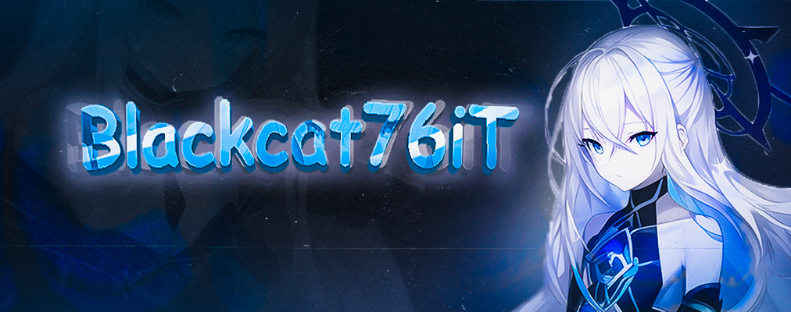

<!-- main banner -->
<!-- maximum displayed image resolution in width: 1012px -->

<h1 align="center">Blackcat76iT</h1>
<!-- немного о себе -->

### Github Stats

  

    
    
             
    
  

